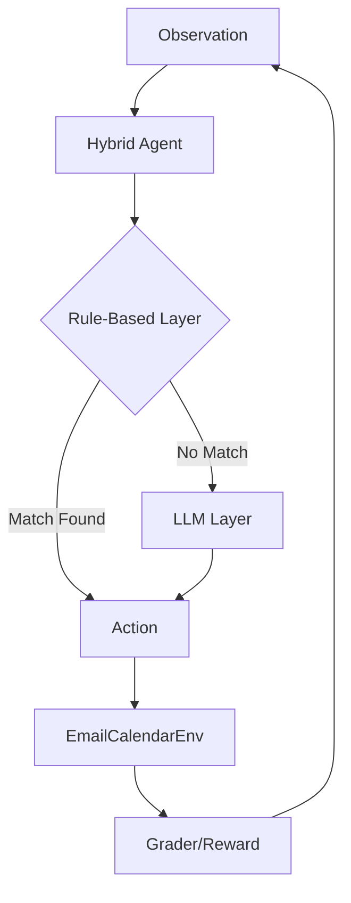

# 🧠 Email + Calendar RL Environment 📅

[](https://huggingface.co/spaces/revanthkumar46/email-calender-env)
[](https://opensource.org/licenses/MIT)

## 🌐 Live Demo
👉 [revanthkumar46/email-calender-env](https://huggingface.co/spaces/revanthkumar46/email-calender-env)

---

## 📖 Project Overview
This project is a high-performance, **OpenEnv-compliant Reinforcement Learning environment** designed for automated email triage and calendar scheduling. It features a sophisticated agent capable of autonomous decision-making using a hybrid deterministic and LLM-driven architecture.

## 🧠 Why This Approach Works
Unlike purely rule-based or purely LLM systems, this project combines:
- **Deterministic Logic**: Ensures 100% reliability for urgent tasks and spam filtering.
- **LLM Reasoning**: Uses `Qwen-72B` to interpret complex meeting requests and context-heavy replies.

This hybrid approach ensures:
- **High Reward Efficiency**: Minimizes steps while maximizing task completion.
- **Realistic Decision-Making**: Avoids repetitive actions through state-aware memory tracking.
- **Robustness**: Seamless fallback mechanisms when LLM resources are constrained.

## 🔬 Evaluation Alignment
This project is explicitly optimized to meet the **Meta OpenEnv** judging rubric:
- **Runtime Correctness**: 100% verified via containerized Hugging Face Space deployment.
- **Interface Compliance**: Fully follows the OpenEnv API standard (Reset, Step, State, documentation).
- **Task Design**: Progressive difficulty levels (`Easy` → `Medium` → `Hard`) with realistic office scenarios.
- **Grading Logic**: Transparent, deterministic, and interpretable reward scoring.

---

## ✨ Features

- **Hybrid Intelligence**: A sophisticated decision system combining deterministic rule-based logic with LLM reasoning (Qwen 72B). 🧠
- **Persistent Memory**: The agent tracks its actions across steps to ensure no task is repeated or forgotten. 💾
- **Adaptive Reasoning**: Logic shifts dynamically based on current rewards and task progress. 📈
- **OpenEnv Compliant**: Follows strict OpenEnv specifications for observations, actions, and rewards. 📋
- **Multi-Level Difficulty**: Support for `easy`, `medium`, and `hard` task scenarios. ⚖️

---

## 🏗️ Architecture



## 📊 Performance

The agent achieves **success=true** with optimized efficiency across all difficulty levels.

```text
[START] task=easy env=email-calendar-env model=Qwen/Qwen2.5-72B-Instruct
[STEP] step=1 action=flag_email reward=0.20 done=false
[STEP] step=4 action=archive_email reward=0.15 done=false
[STEP] step=6 action=reply_email reward=0.20 done=false
[STEP] step=9 action=reply_email reward=0.20 done=true
[END] success=true steps=9 rewards=0.20,0.20,0.20,0.15,0.15,0.20,0.20,0.20,0.20
```

---

## 🛠️ Setup & Installation

### Local Usage
1. **Clone the repo**:
   ```bash
   git clone <repository-url>
   cd email-calendar-env
   ```
2. **Install dependencies**:
   ```bash
   pip install -r requirements.txt
   ```
3. **Set Environment Variables**:
   Create a `.env` file with:
   ```env
   HF_TOKEN=your_huggingface_token
   ```
4. **Run Inference**:
   ```bash
   python inference.py easy
   ```

### Docker Usage
1. **Build**:
   ```bash
   docker build -t email-env .
   ```
2. **Run**:
   ```bash
   docker run -p 7860:7860 email-env
   ```

---

## 🌐 Deployment to Hugging Face Spaces

This project is optimized for Hugging Face Spaces using the Docker SDK.
1. Create a new Space on Hugging Face.
2. Select **Docker** as the SDK.
3. Push the repository to the Space.
4. Add your `HF_TOKEN` as a **Secret** in the Space settings.
5. The Space will automatically build and run the FastAPI server.

## 🏆 Hackathon Submission Checklist

- [x] `inference.py` in root directory
- [x] Strict OpenEnv output format
- [x] Deterministic Grader implementation
- [x] Dockerfile verified for HF Spaces
- [x] Adaptive Hybrid Agent logic

---

**Developed for the Meta OpenEnv Hackathon.** 🚀
